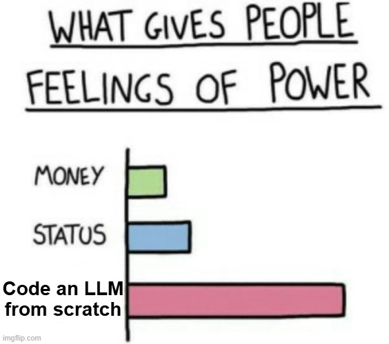

# LLM from scratch, no pretrained models, no HF transformers

This is implementation of decoder-only transformer based LLM with next-token prediction objective. This implementation use `tokenizers` library from HF, attention use GQA (Grouped query attention), RMSnorm layer, GeGLU activation function, and RoPE (Rotary positional embedding).

There are four version:
- Using AdamW optimizer and lorem ipsum datasets (Broken RoPE) [[colab notebook]](https://colab.research.google.com/drive/1IfC8lQBi-PIuuLL0dFziCQ2CakIDVGiZ?usp=sharing)
- Using SOAP optimizer and lorem ipsum datasets (Broken RoPE) [[colab notebook]](https://colab.research.google.com/drive/15ZIynpMotd2z7pRGU3qLLfylacCGJpVI?usp=sharing)
- Using SOAP optimizer, synthetic number datasets, and larger parameter (Broken RoPE) [[colab notebook]](https://colab.research.google.com/drive/1BekXGDokeM7DwgggZptjQzcgkzIviXQ7?usp=sharing)
- Using SOAP optimizer, synthetic number datasets, smaller parameter, and larger epochs (Broken RoPE)) [[colab notebook]](https://colab.research.google.com/drive/1EYlVeVwdTwG6E3yo1cxc6LSFat42L6yd?usp=sharing)

Notes: There's a small mistake in RoPE implementation where RoPE is applied to value_embedding (it should be applied only to query and key)
